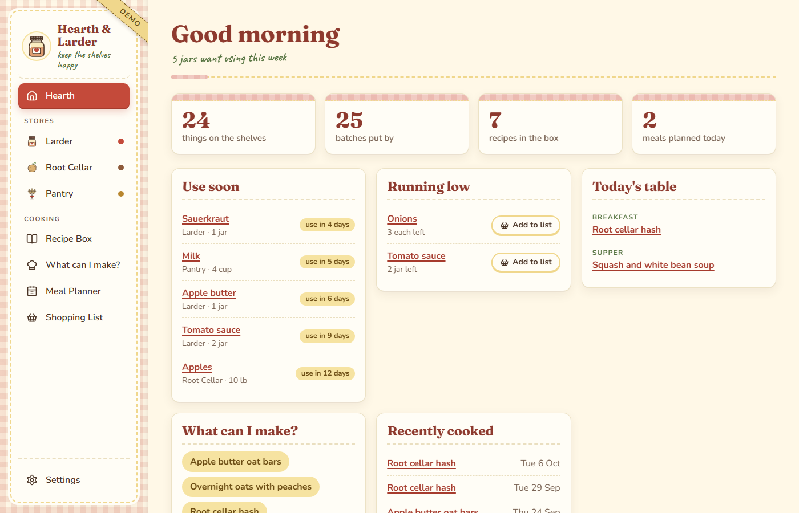
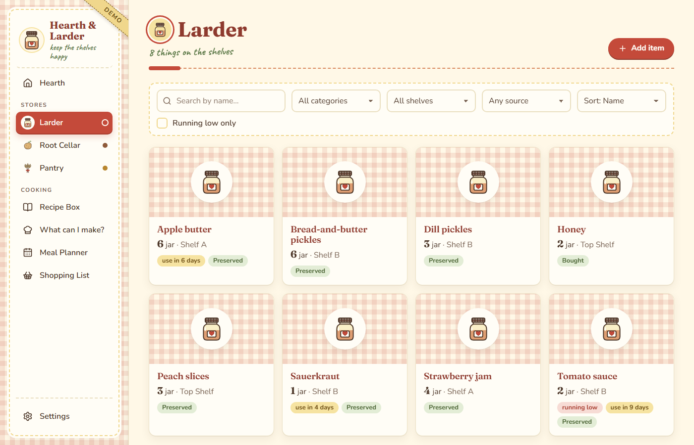
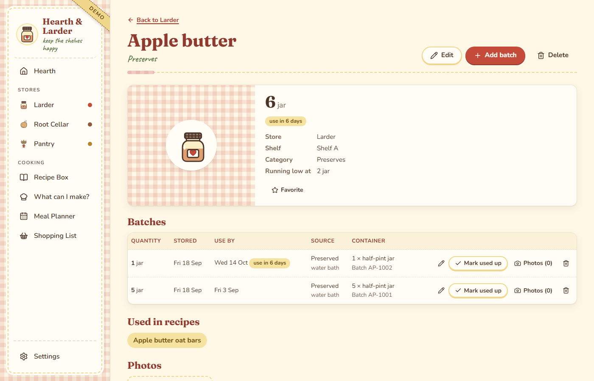
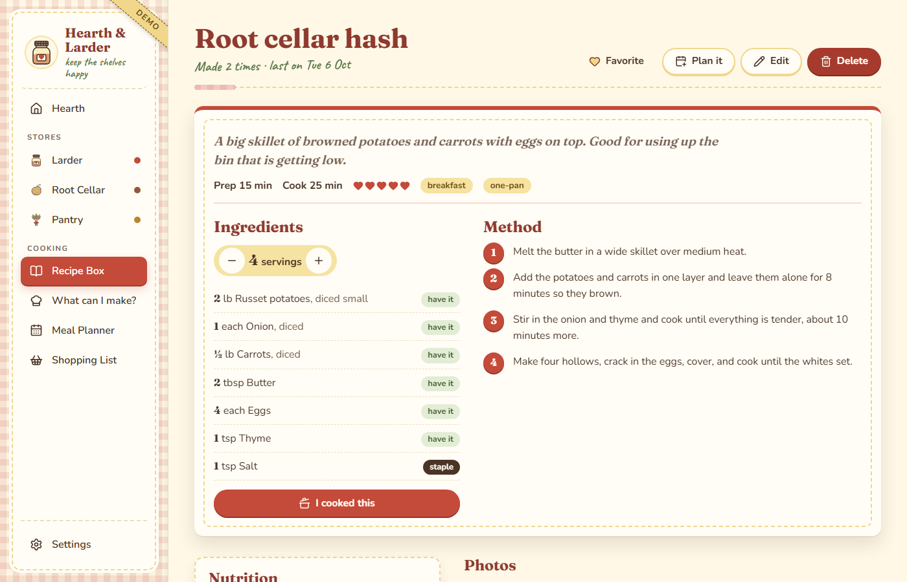
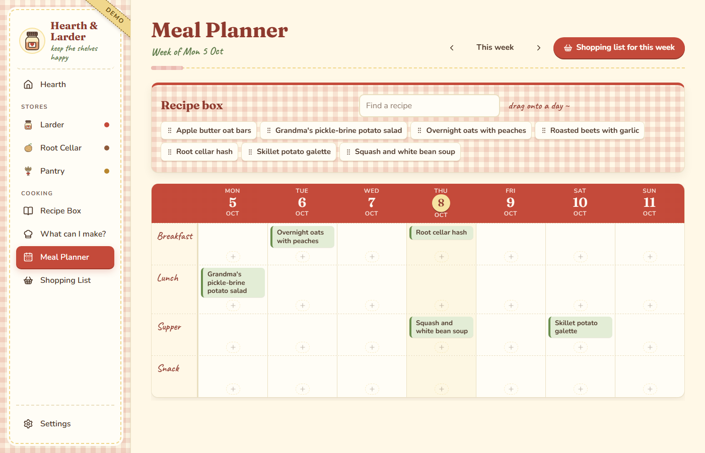
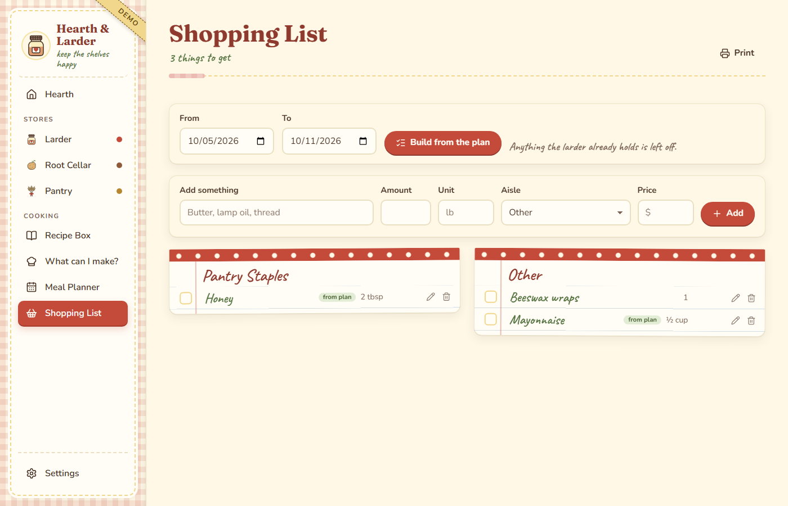
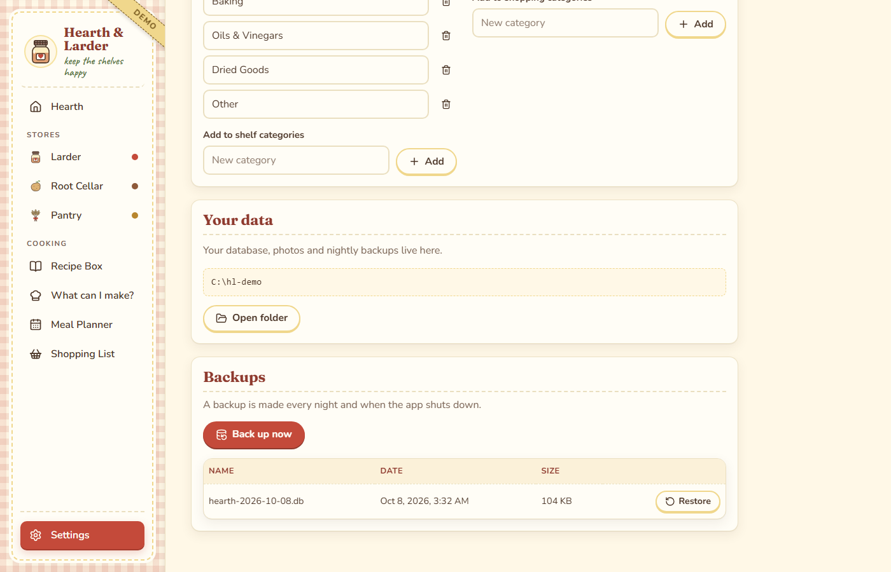

# Hearth & Larder

Hearth & Larder is a small kitchen keeper that runs on your own computer. It tracks what is in your larder, root cellar and pantry, holds your recipes, and helps you plan the week's meals and shopping.



## What it does

- Keeps three stores (Larder, Root Cellar and Pantry), each with items, batches, use-by dates, photos and notes. You can move an item to another store.
- Warns you when something is close to its use-by date or running low. You pick how many days ahead in Settings.
- Stores recipes with scaling, ratings, tags and nutrition, and shows which ingredients you already have.
- Suggests what you can make from what is on the shelves.
- Plans meals on a weekly calendar. Drag a recipe onto a day, or use the plus button. Click the pencil on a meal to change its day, meal or servings.
- Builds a shopping list from the plan, leaving off anything the larder already covers or that you have already ticked.
- Takes ingredients off the shelves when you tell it you cooked a recipe. Each recipe keeps a cooking history, and deleting an entry puts the ingredients back.
- Lets you undo a delete for a few seconds. Deleted things are kept for 30 days before they are purged.
- Backs up your data every night.

| | |
|---|---|
|  |  |
|  |  |
|  |  |

## What you need

- Windows 10 or 11 for the full setup with scheduled tasks and a Desktop shortcut. It also runs on macOS and Linux (see below).
- Node 24 or newer.
- Chrome is recommended. The Desktop shortcut opens a Chrome app window and falls back to your default browser.

## Install

Download or clone this repository, open a terminal in its folder, and run:

```
npm run setup
```

Setup installs the dependencies, builds the app, writes a `config.json`, and creates your data folder. Then run this to set up the daily routine on Windows:

```
npm run install-windows
```

That does two things:

- Registers two scheduled tasks. "Hearth & Larder - Start Morning" starts the app at 5:30 AM, and "Hearth & Larder - Stop 9-30 PM" backs up your data and stops the app at 9:30 PM. Both run on battery.
- Puts a "Hearth & Larder Dashboard" shortcut on your Desktop.

The app listens on port 4193, on your own computer only. It turns away requests from other computers and from other websites open in your browser. Nothing is sent anywhere.

To stop the app by hand, run `npm run stop`.

## Where your data lives

Everything is in one folder: `Documents\Hearth & Larder Data`. It holds the database (`hearth.db`), your photos (`photos\`) and your backups (`backups\`).

The app backs up every night at 9:30 PM when the Windows tasks are installed. Otherwise it backs up when it starts if the last backup is a day old, and you can press Back up now in Settings at any time. Backups are kept for 30 days, and the five newest are always kept.

Settings can also restore an earlier backup. Restoring makes a safety copy of your current data first. Photos you deleted after that backup come back with it. Photos you added after the backup stay in the photos folder, but the restored data doesn't list them.

To use a different folder or port, edit `config.json` in the app's folder. Setup creates this file, and Git ignores it, so your settings stay out of the repository. In JSON, every backslash in a Windows path must be doubled:

```json
{ "dataDir": "D:\\Kitchen Data", "port": 4193 }
```

Restart the app afterward. The environment variables `HEARTH_DATA_DIR` and `HEARTH_PORT` override the file. If `config.json` can't be read, the app says which file is wrong and stops.

## macOS and Linux

The scheduled tasks and Desktop shortcut are Windows only. Elsewhere, run `npm run setup`, then start the app whenever you like:

```
npm start
```

Open http://localhost:4193 in your browser.

## Try the demo

```
npm run demo
```

The demo opens at http://localhost:4195 with sample items, recipes and a planned week. It keeps its data in a separate folder (`Hearth & Larder Demo Data`), so your real kitchen is untouched. To start the demo over with fresh sample data, run:

```
npm run demo -- --reset
```

Reset only works on the demo folder. It refuses to touch your real data folder.

## Uninstall

Run `npm run uninstall-windows`. It stops the app and removes the two scheduled tasks and the Desktop shortcut. Your data folder stays where it is, so you can delete it yourself when you are sure you don't need it.

## Development

```
npm run dev        # API with auto-restart plus the Vite dev server
npm test           # unit and API tests
npm run test:e2e   # the browser test, using a throwaway data folder on port 4199
```

## Credits

- Fonts: Fraunces, Nunito and Caveat, under the SIL Open Font License.
- Icons: [Lucide](https://lucide.dev), under the ISC license.
- The illustrations and sample recipes were made for this project.

## License

MIT. See [LICENSE](LICENSE). Made by Stephanie Lippencott.
